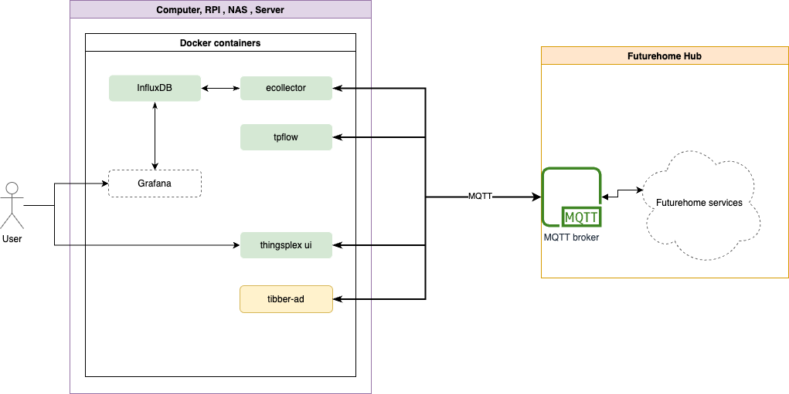
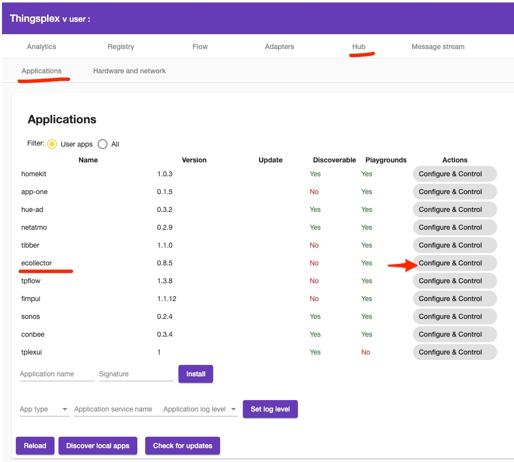
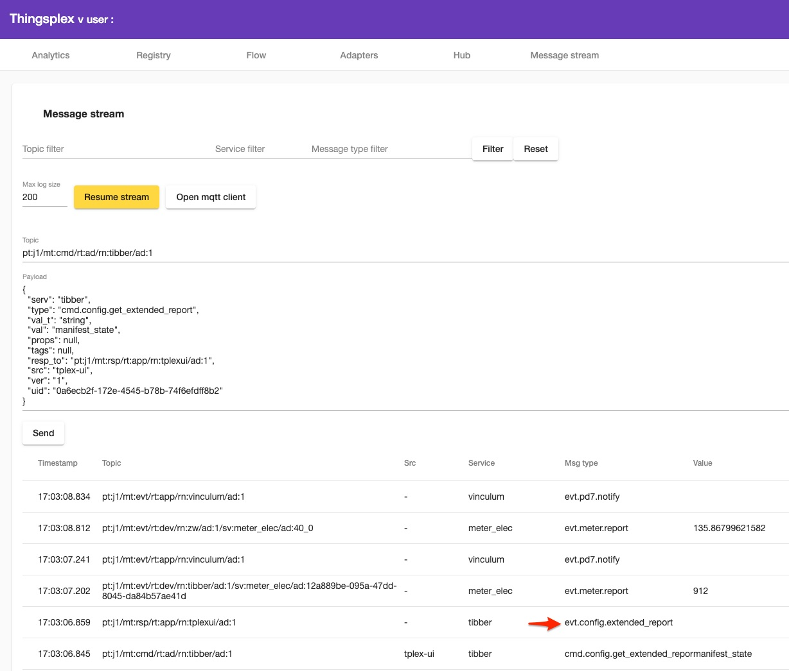
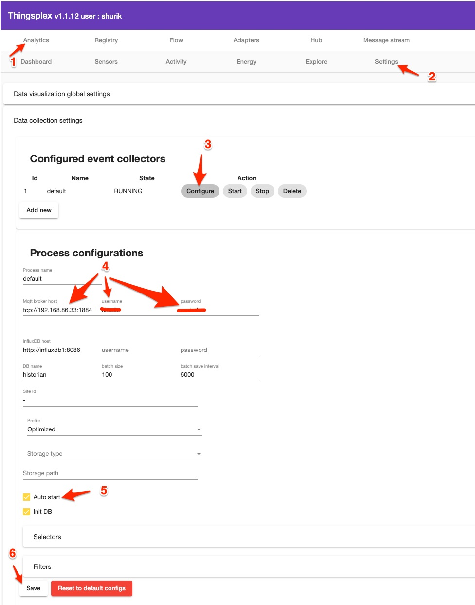

## Installing Thingsplex components along with Futurehome smarthub.

System overview



## Pre-installation steps

The installation instructions assume that a user is familiar with the docker engine and is already configured and running.

It's advised to stop the internal `ecollector` service before installing an external container. It can be done in Hub->Application section of Thingsplex UI. 



If you have `tibber` already installed on Futurehome hub and you want to reuse existing registration, follow the step below which shows how to extract home-id and tokens. Or you can skip that and follow the regular registration process through the FH app.


## Manual installation

Configure custom docker network by running the command: 

```
docker network create tplex-net
```

The next step is optional but might be helpful if you prefer to manage docker over friendly UI.

```
docker run -d -p 8000:8000 -p 9443:9443 --name portainer \
    --restart=always \
    -v /var/run/docker.sock:/var/run/docker.sock \
    -v portainer_data:/data \
    cr.portainer.io/portainer/portainer-ce:2.9.3
```    

**influxdb V 1.7.X**

```

docker run --name influxdb1 -d -p 8086:8086 -v influxdb:/var/lib/influxdb \
           --network tplex-net --restart unless-stopped influxdb:1.7.11-alpine

```

**ecollector**

Set your parameters before running the command. 

```
docker run  -d -v ecollector:/thingsplex/ecollector/data --restart unless-stopped \
     -e MQTT_URI=tcp://set_mqtt_broker_ip:1884 \
	 -e MQTT_USERNAME=set_your_username -e MQTT_PASSWORD=set_your_password \
	 --network tplex-net --name ecollector thingsplex/ecollector:latest ecollector

```

**tibber-ad** 

IMPORTANT - HOME_ID and TOKEN parameter needed only in case if one wants to reuse TOKEN and HOME_ID from existing registration , otherwise remove these settings. 

Token extraction (optional): 

Request msg : 

`topic` : `pt:j1/mt:cmd/rt:ad/rn:tibber/ad:1`

`message` :
```
{
  "serv": "tibber",
  "type": "cmd.config.get_extended_report",
  "val_t": "string",
  "val": "manifest_state",
  "props": null,
  "tags": null,
  "resp_to": "pt:j1/mt:rsp/rt:app/rn:tplexui/ad:1",
  "src": "tplex-ui",
  "ver": "1",
  "uid": "0a6ecb2f-172e-4545-b78b-74f6efdff8b2"
}
```



Click on response message and copy token and home-id from there. 

Stop and disable or uninstall `tibber-ad` that is installed on FH smarthub. Otherwise, two adapters will be publishing the same information twice. 

 The command for starting container if you want to reuse your token : 

```
docker run -d -v tibber:/thingsplex/tibber/data --restart unless-stopped \
           -e MQTT_URI=tcp://set_mqtt_broker_ip:1884 \
           -e MQTT_USERNAME=set_your_username -e MQTT_PASSWORD=set_your_password \
           -e HOME_ID=set_tibber_home_id -e TOKEN=set_tibber_auth_token \
           --network tplex-net --name tibber-ad thingsplex/tibber-ad:latest
```

otherwise :

```
docker run -d -v tibber:/thingsplex/tibber/data --restart unless-stopped \
           -e MQTT_URI=tcp://set_mqtt_broker_ip:1884 \
           -e MQTT_USERNAME=set_your_username -e MQTT_PASSWORD=set_your_password \
           --network tplex-net --name tibber-ad thingsplex/tibber-ad:latest
```

## Install all containers at once using docker-compose or docker stacks.

```
version: '3'
services:
  
  influxdb1:
    image: influxdb:1.7.11-alpine
    restart: unless-stopped
    networks:
      - tplex-net
    ports:
      - "8086:8086"
    volumes:
      - influxdb1:/var/lib/influxdb

  ecollector:
    image: thingsplex/ecollector:latest
    restart: unless-stopped
    networks:
      - tplex-net
    environment:
      - MQTT_USERNAME=set_your_username
      - MQTT_PASSWORD=set_your_password
      - MQTT_URI=tcp://set_mqtt_broker_ip:1884
    volumes:
      - ecollector:/thingsplex/ecollector/data
    depends_on:
      - "influxdb1"

  tibber-ad:
    image: thingsplex/tibber-ad:latest
    restart: unless-stopped
    networks:
      - tplex-net
    environment:
      - MQTT_USERNAME=set_your_username
      - MQTT_PASSWORD=set_your_password
      - MQTT_URI=tcp://set_mqtt_broker_ip:1884
      - HOME_ID=set_tibber_home_id
      - TOKEN=set_tibber_auth_token
    volumes:
      - tibber:/thingsplex/tibber/data

volumes:
  influxdb1: {}
  ecollector: {}
  tibber: {}

networks:
  tplex-net:
    external: false
```


Post-installation steps

Ecollector service must be configured after the first installation. 
The user must set FH smarthub IP address and port (given that port is open) and configure connection parameters to the new influxdb instance. Influxdb host parameter must be set to `influxdb1:8086`



## Install Thingsplex components along with Home Assistant 
WIP 