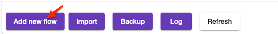

# Flows

## Introduction

Thingsplex Flows is an automation engine. Each flow represents automation that is defined as a sequence of connected nodes (graph). Each node represents either flow trigger, data manipulation, flow control, or activity. Connections between nodes represent transitions (flows) from one node to another.

## Flow configuration

To create a new flow, a user has to navigate to the "Flows overview" section of Thingsplex UI. 

The user has to provide flow name, group, details, and how to execute new flows.

Flow engine supports three options of how the flow engine starts new flow execution (flow instance) :

- Run all flow instances in parallel.
- Keep already running instance and skip new flow instance.
- Start a new flow instance and abort all running instances.

After submitting initial configurations, the user is redirected to the flow configurator view.  

## Nodes

### Overview

All nodes except trigger nodes have one inbound connector and multiple outbound transition connectors. Trigger nodes don't have an inbound connector.

Outbound connectors can be one of 4 types : 

- A green color connector means successful node execution or "true" for flow control nodes.
- A red color connector means an error or negative node execution.
- Orange color means timeout. Not every node supports timeout.
- A yellow color means the false outcome of a flow control node.  

### Node groups

* [Triggers](nodes/triggers.md)
* [Actions](nodes/actions.md)
* [Flow control](nodes/flow-control.md)
* [Data operations](nodes/data.md)
* Tools

