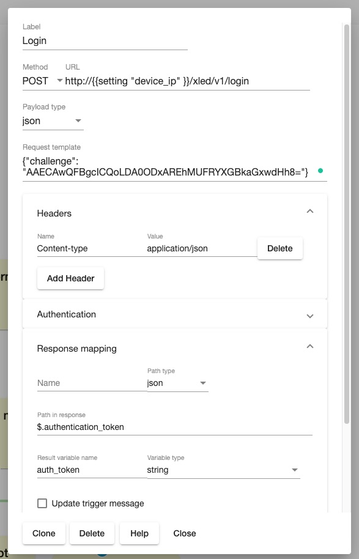
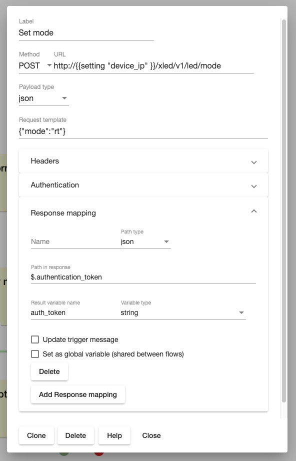
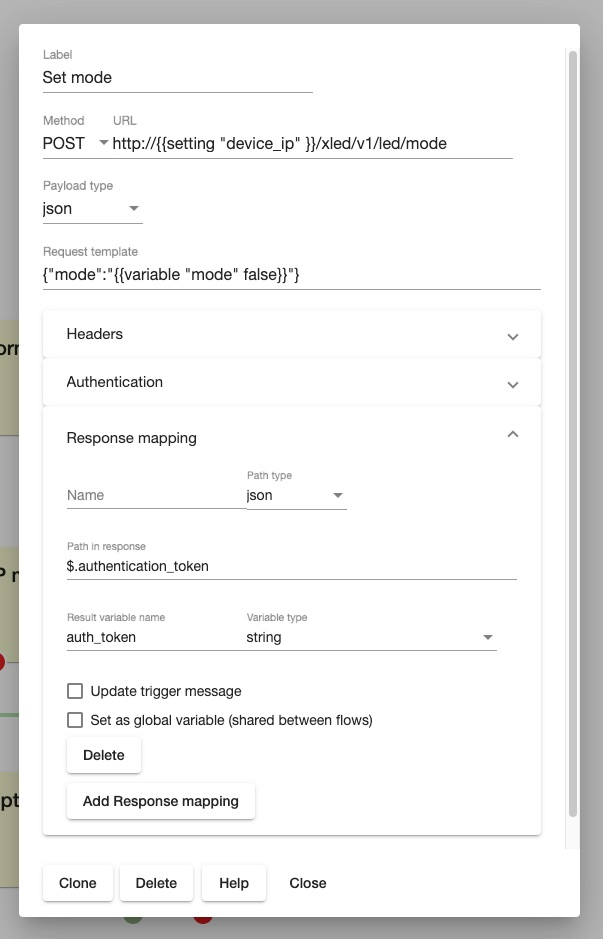
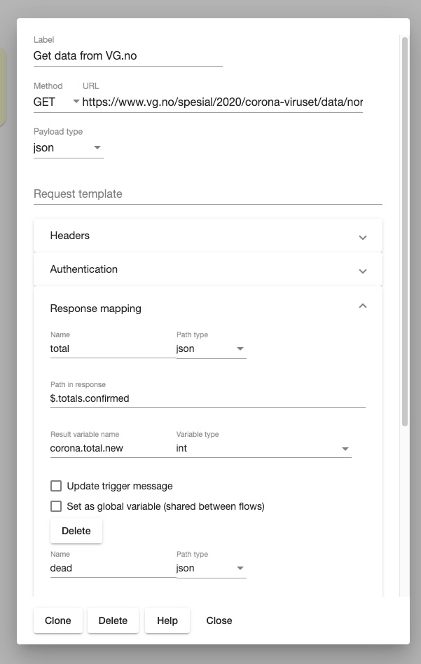
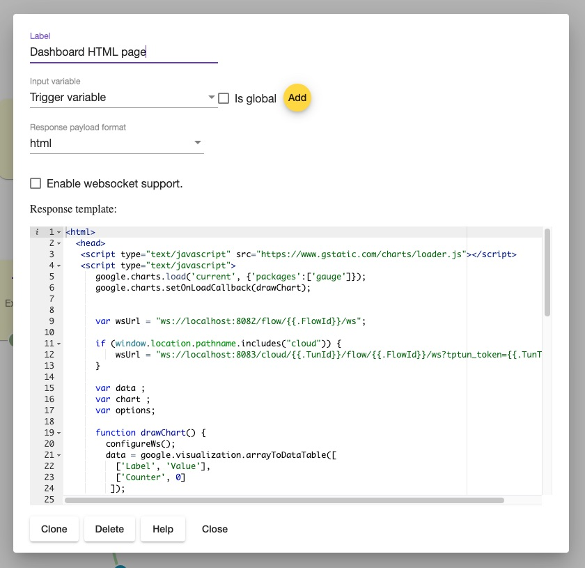
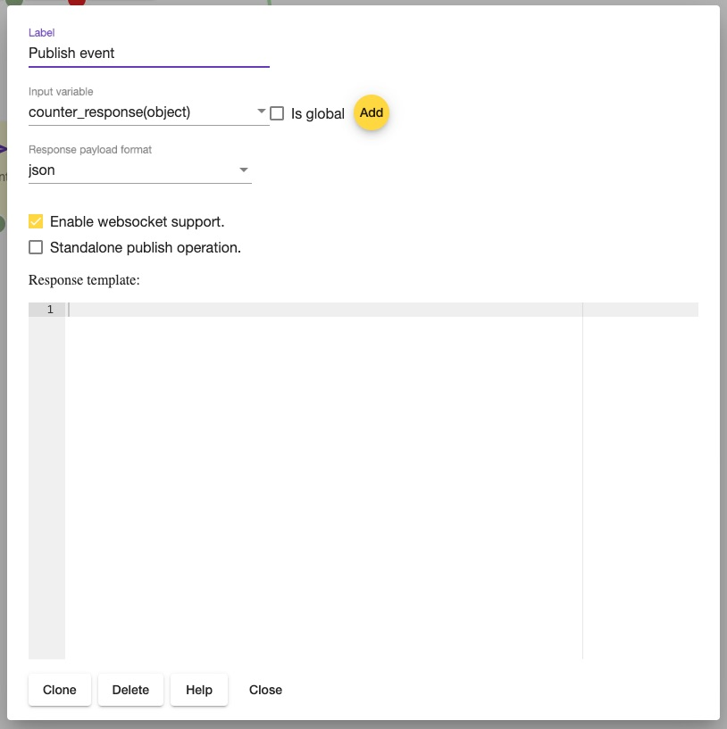

# Actions

Action nodes generate command message and send it to another application or device.

## Generic Action

The Action sends FIMP command message to a device or application

### Action config 

Assisted configuration , a user has to choose a device and functionality using wizard.

 


### Advanced Service binding 

 In some cases the node can't be configured by means of wizard and that's when advanced configuration UI can be usefull.
 
 Mandatory properties : 
 
 - *Service* - is a name of fimp service 
 - *Interface* - is a name of fimp message type 
 - *Address* - is full topic , the field supports templating . 
 
 Using template variables in *Address* field :
 
 ```
 
 pt:j1/mt:evt/rt:dev/rn:test/ad:1/sv:sensor_lumin/ad:{{ variable "counter" false }}_0
 
 ```

 where *counter* is a name of variable 
 *false* is a flag which defines whether the variable is global or local
  In our example, if variable counter == 11 , the address string will be converted into - 
 `pt:j1/mt:evt/rt:dev/rn:test/ad:1/sv:sensor_lumin/ad:11_0` 
 
 
 Properties are used for configuring virtual device and are optional. 
 Supported properties:
  - *Register as virtual device (optional)* - if the flag is selected , the service will be added into inclusion report and will be part of virtual device .
 - *Service group (optional)* - name of service group in inclusion report. In a virtual device multiple services can be put into a logical group.
 - *Service properties* - object will be used as service properties. 
 
  
### Payload configuration 

In previos steps a user configures target device or service. Last step is to define configuration for the command (payload). For instance, the flow engine must know if it has to send On (true) or Off (false).
The node supports 2 payload configuration options :
 * set static value.
 * set variable that contains payload value. 

## HTTP request action 

The action makes HTTP request to configured endpoint and saves response to variable. 










## HTTP/WS reply action 

The action sends reply to http request (from HTTP trigger) or publishes websocket message. 



