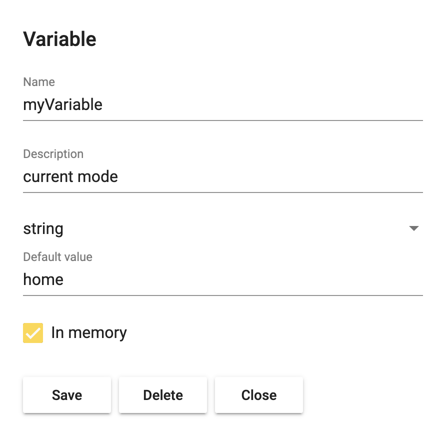
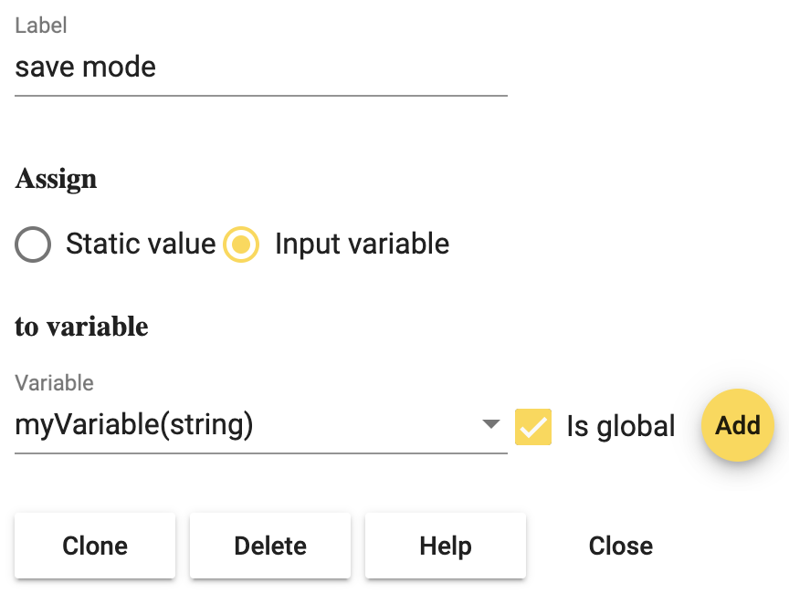
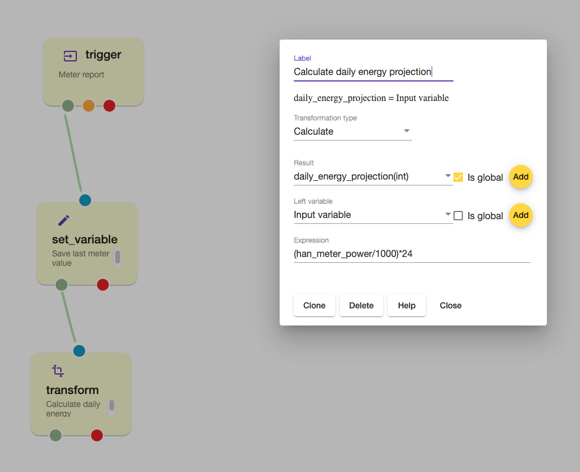
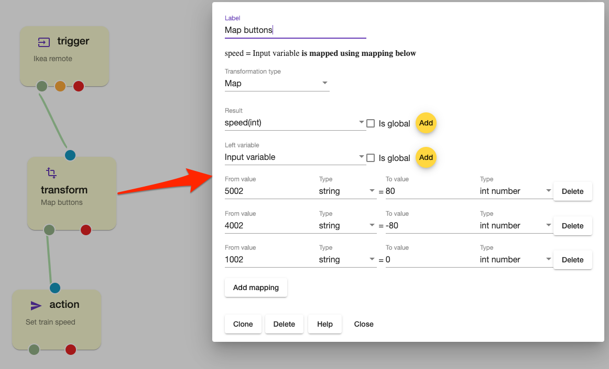

# Data operations

## Set variable node

You can make as many variables as you like in your flows. Variables can be used to save the state of your devices, values read from a REST Action, mode of your site or similar. In the **conditions** section there was mentioned that it is possible to trigger **if** mode is not vacation. To check what mode you are in, you can use a global variable. This can be done by using a **Home event trigger** that triggers whenever mode is changed, that sends its value directly in to a **set_variable** node that saves the string value in a variable. First we need to make the variable. 

To make a variable, click on **Add** in the set_variable node. Then choose a name, description, and type. In this case the type should be **string** as we want to save the mode. If you save the variable in a different flow than where you want to use it, you need to make sure it is **Global** by ticking the **in memory** box. Your variable configuration should then look like this:

## Transform node

Transform node should be used for more advanced data manipulations .
The result of transformation is always assigned to *Result variable*

**Supported transformation types :** 
* Calculate 
* Map 
* JsonPath 
* XPath
* Tempelate 

### Calculate

The transformation evaluates expression from *Expression* field and saves result into *Result variable*.
The expression supports all local and global variables (addressed by name) .Input variable can be addressed using **input** name and Left variable (from dropdown menu) as **variable** .
Assuming we have variables *address* , expression can be `address+100` , result will be assigned to *Result variable*

#### Supported operators 

- Modifiers: `+ - / * & | ^ ** % >> <<`
- Comparators: `> >= < <= == != =~ !~`
- Logical ops: `|| &&`
- Numeric constants, as 64-bit floating point (12345.678)
- String constants (single quotes: `'foobar'`)
- Date constants (single quotes, using any permutation of RFC3339, ISO8601, ruby date, or unix date; date parsing is automatically tried with any string constant)
- Boolean constants: `true false`
- Parenthesis to control order of evaluation ( )
- Arrays (anything separated by , within parenthesis: `(1, 2, 'foo')`)
- Prefixes: `! - ~`
- Ternary conditional: `? :`
- Null coalescence: `??`

For more info - [Operators](https://github.com/Knetic/govaluate/blob/master/MANUAL.md)

### Map

The transformation maps input value, from input variable to output variable using provided mapping.

### JsonPath

### Xpath

### Template