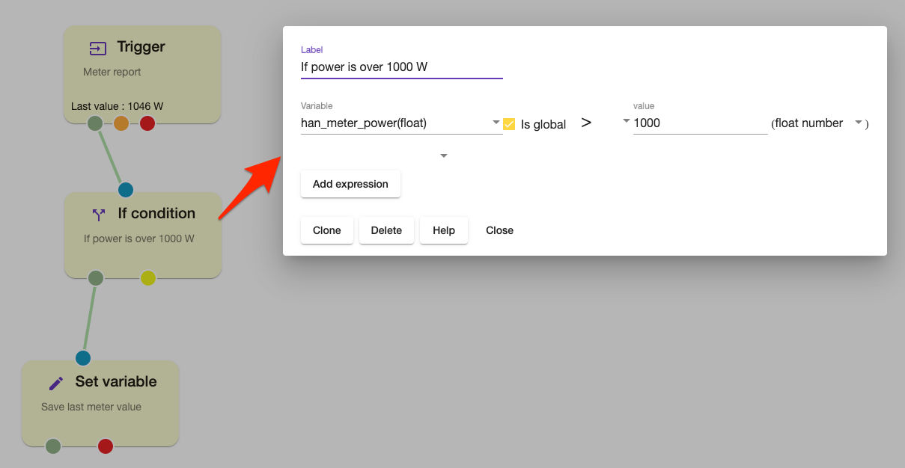
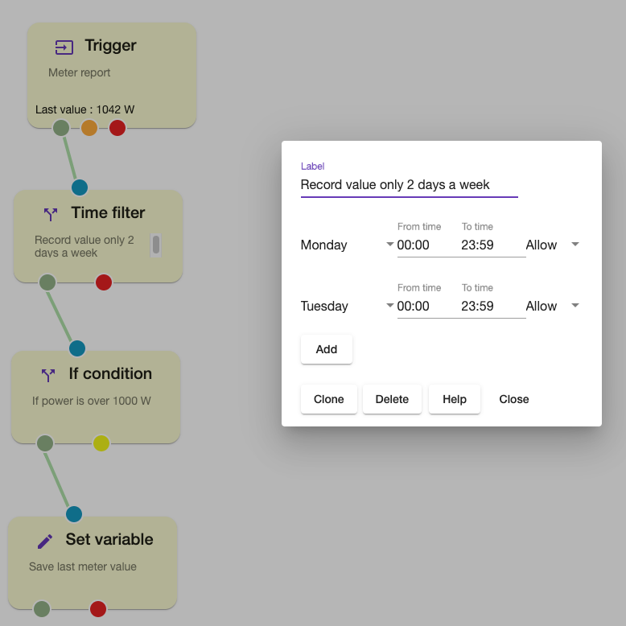
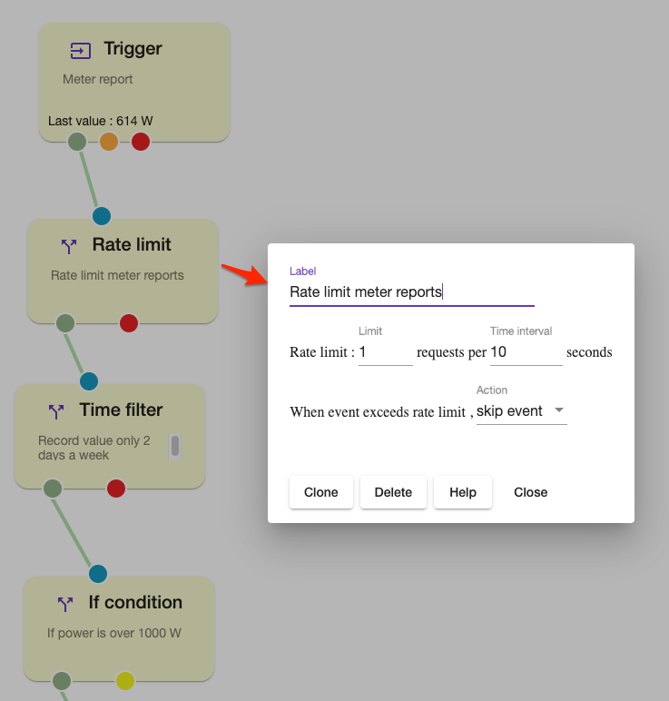

# Flow control

## If condition 

The node defines node transition rules , it takes variable and compares against constant value. 

## Time filter

The node implements time base filter 

## Rate limit

The node performs rate limiting of messages passing through the node.

