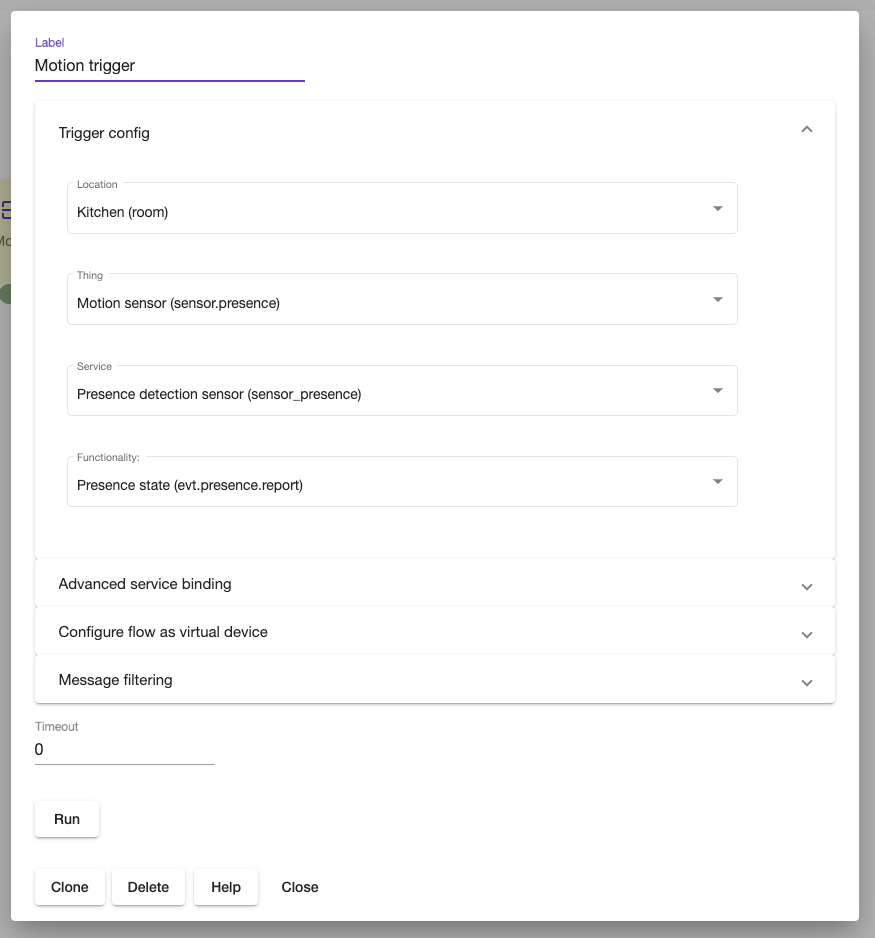

# Triggers

Trigger is a special node type that is listening for events and starts flow execution once conditions are met.

## Generic trigger

Generic trigger can be configured to react on any event generated by any device or application.


Once configured, the node displays live *Last value*. It's handy tool during node configuration process.  

Trigger node is configured either using *Normal* or *Advanced* node.

### Normal/basic mode

User configures trigger by selecting objects using dropdown selectors.



### Advanced mode

The mode should be used only when device/event can't be configured using Normal mode.The mode imply that user know exact device-service topic address,service name and interface. Address can be dynamically configured using templating syntax, for instance 
```

pt:j1/mt:evt/rt:dev/rn:zw/ad:1/sv:scene_ctrl/ad:{{setting "dev.address"}}_0

```
or 
```

pt:j1/mt:evt/rt:dev/rn:zw/ad:1/sv:scene_ctrl/ad:{{variable "address" false}}_0

```


### Virtual devices

A node will be part of virtual device if `Register as virtual service` is selected.

### Message filtering

Trigger node supports optional payload level filtering.


## Time trigger

The trigger is activated by scheduled time events. Currently supported time and astro time (sunrise and sunset) event scheduling.

### Time 


The time should be set using cron format.It requires 5 entries representing: minute, hour, day of month, month and day of week, in that order.

```
# ┌───────────── minute (0 - 59)
# │ ┌───────────── hour (0 - 23)
# │ │ ┌───────────── day of the month (1 - 31)
# │ │ │ ┌───────────── month (1 - 12)
# │ │ │ │ ┌───────────── day of the week (0 - 6) (Sunday to Saturday;
# │ │ │ │ │                                   7 is also Sunday on some systems)
# │ │ │ │ │
# │ │ │ │ │
# * * * * *
```

Special characters:

***Comma ( , )***

Commas are used to separate items of a list. For example, using "MON,WED,FRI" in the 5th field (day of week) means Mondays, Wednesdays and Fridays.

***Dash( - )***

Dash defines ranges. For example, 2000-2010 indicates every year between 2000 and 2010, inclusive.

***Example :***
 `0 20 * * 0,1,2,3,4,5,6` - the configuration will trigger event every day at 20:00

***Predefined schedules***

You may use one of several pre-defined schedules in place of a cron expression.

```
Entry                  | Description                                | Equivalent To
-----                  | -----------                                | -------------
@yearly (or @annually) | Run once a year, midnight, Jan. 1st        | 0 0 1 1 *
@monthly               | Run once a month, midnight, first of month | 0 0 1 * *
@weekly                | Run once a week, midnight between Sat/Sun  | 0 0 * * 0
@daily (or @midnight)  | Run once a day, midnight                   | 0 0 * * *
@hourly                | Run once an hour, beginning of hour        | 0 * * * *
```

***The node also supports intervals***

`@every <duration>` 

For example, "@every 1h30m10s" would indicate a schedule that activates after 1 hour, 30 minutes, 10 seconds, and then every interval after that.

### Astrotime


The trigger saves "sunset" or "sunrise" into Input variable.


## Home event


The node triggers flow executed after home mode has been changes in Futurehome system or Shortcut has been executed by user .

## HTTP and Websocket trigger

The node trigger flow execution by receiving HTTP request of Websocket message. 


