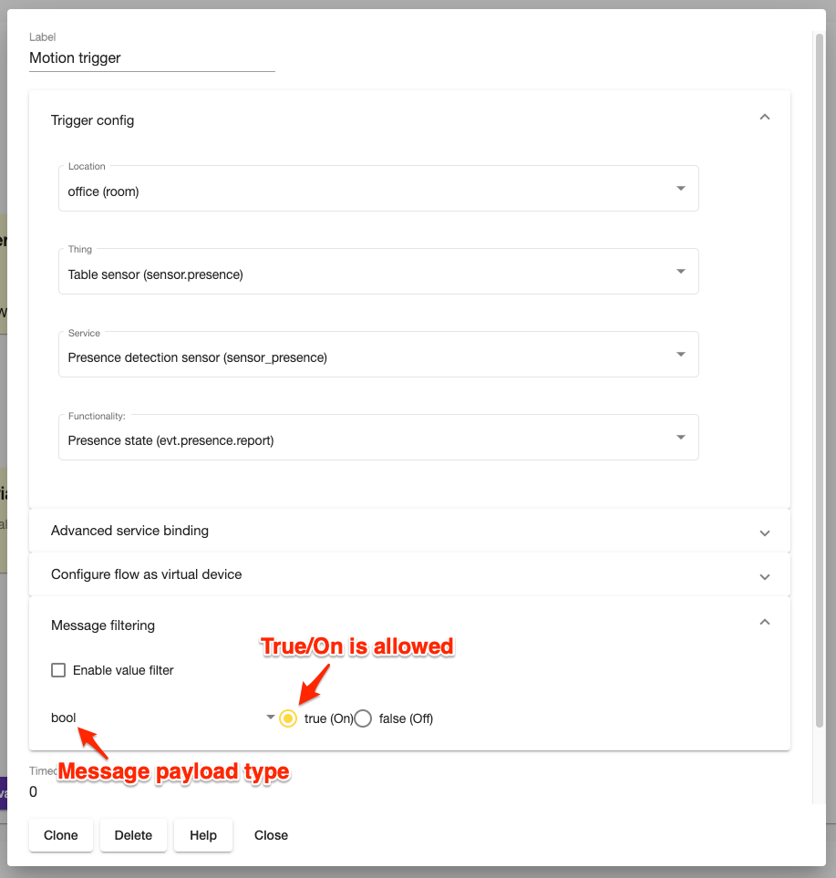

## Triggers

Trigger is a special node type that is listening for events and starts flow execution.

### Generic trigger

Generic trigger can be configured to react on any event generated either by device or application.

Trigger node is configured either using *Normal* or *Advanced* node.

#### Normal/basic mode

User configures trigger by selecting objects using dropdown selectors.

#### Advanced mode

The mode should be used only when device/event can't be configured using Normal mode.The mode imply that user know exact device-service topic address,service name and interface.

#### Virtual devices

A node will be part of virtual device if `Register as virtual service` is selected.

#### Message filtering

Trigger node supports optional payload level filtering.

### Home event

### Time trigger
