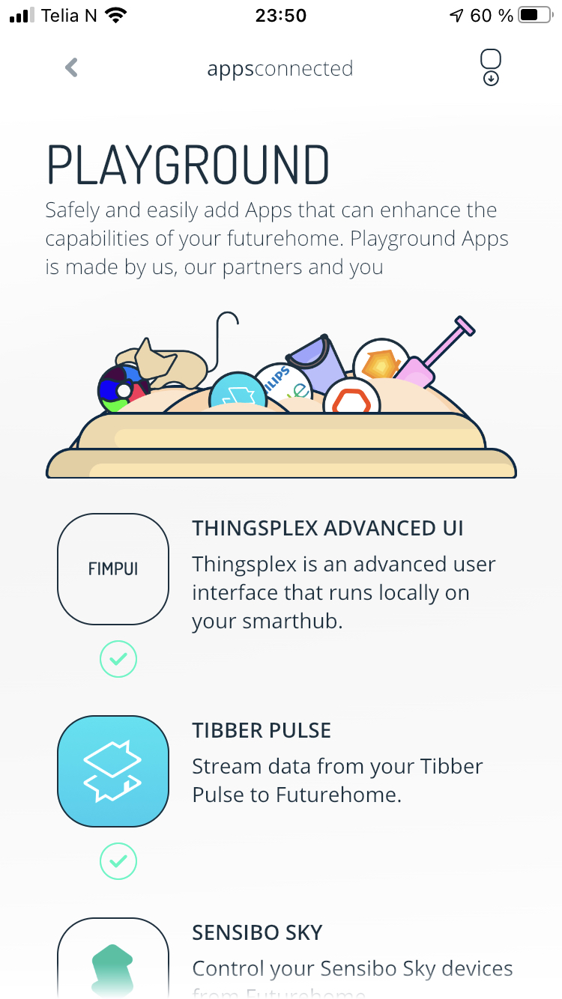
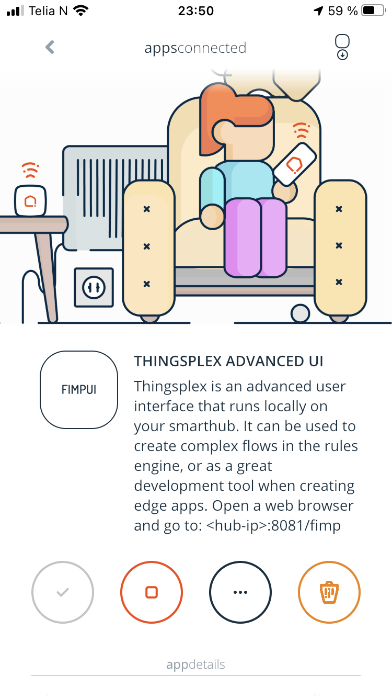
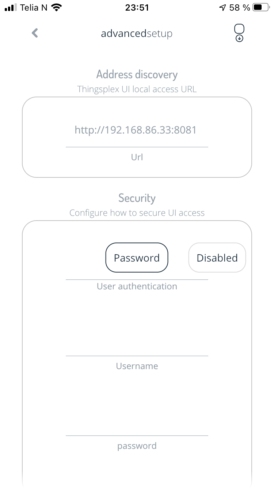
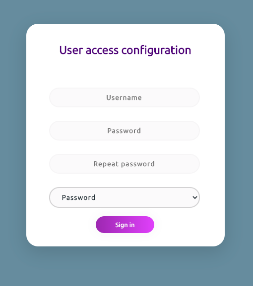
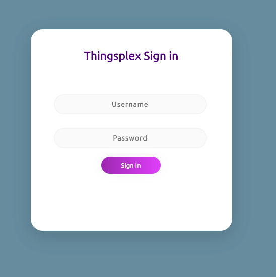

# Thingsplex UI installation 

## Futurehome gateway 

Futurehome gateway supports Thingsplex UI natively . It can be installed via Playgrounds section of Futurehome X app .

Open Playgrounds section in Futurehome app :

Click on Configure button : 

Copy address from Address dicovery field and paste it into browser on your computer.

The same view can be used to configure username and password or disable user authentication.

## Docker 

## Standalone binaries 

## Building from source 

## Securing Thingsplex 

### Sign up

By default Thingsplex UI is secured by username and password. After first installation the system will ask user to create admin user : 

It is not advices but user can also can disable authentication by selecting *Disable* option in dropdown menu.

### Login 

Next time user will be asked to login using usarname and password provided in previos step 

